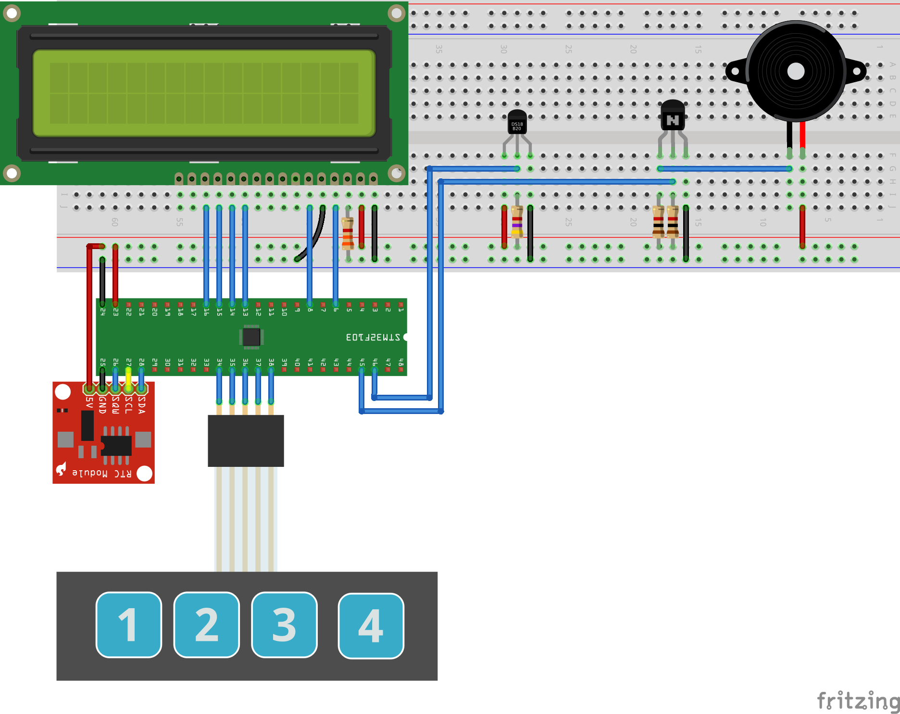
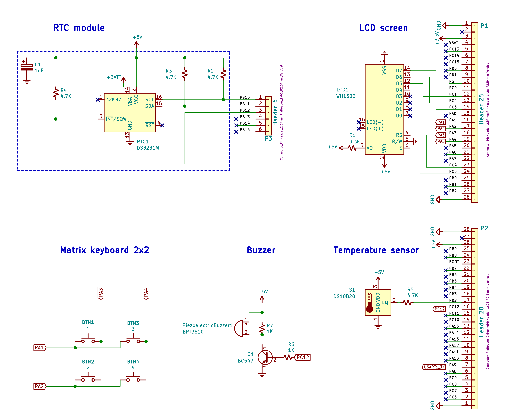

# Kitchen clock
This is the project of the kitchen clock with the following functions:
- date;
- alarm;
- clock;
- 24 hour time format;
- thermometer.
## Used electronic components
- STM32VLDISCOVERY board with the STM32F100RB MCU;
- digital thermometer DS18B20;
- LCD screen WH1602;
- matrix keyboard 2x2;
- RTC module DS3231;
- piezoelectric buzzer;
- resistors:
  - 1 kohm *(x2)*;
  - 4.7 kohm *(x1)*;
  - 3.3 kohm *(x1)*;
- NPN transistor BC547 *(x1)*;
- breadboard;
- jumper wires.
## Breadboard connection

## Electrical wiring diagram

## Building and installing
### Prerequisites
Building requires libopencm3 and an arm-none-eabi toolchain.
The build must be tuned with limited number of parameters in Makefile,
by specifying them as environment variables, for example:
```
export PATH=/opt/gcc-arm-none-eabi-9-2020-q2-update/bin:$PATH
export CROSS_COMPILE=arm-none-eabi-
export OPENCM3_DIR=/home/mark/repos/libopencm3
```
- `CROSS_COMPILE` is the alias for arm-none-eabi- prefix
- `OPENCM3_DIR` contains path to the library
### Serial console
Serial communication (used in the project, for example, for debug) is
performed via `minicom` through RS-232 adapter.
*PA9* as the default *USART1_TX* pin is used on the STM32VLDISCOVERY board.

UART configuration:
```
115200 8N1
No flowcontrol
```
### Building
`$ make`
### Flashing
For flashing `st-flash` utility is used.

`$ make flash`
## Author
**Mark Sungurov <mark.sungurov@gmail.com**
## License
This project is licensed under the GPLv3.
